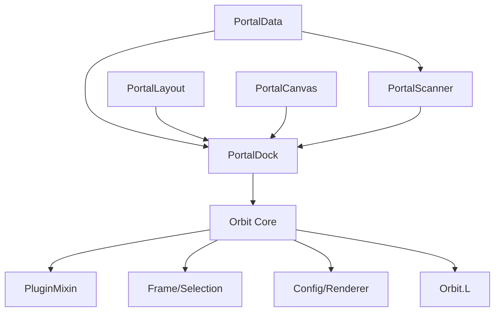

# orbit portal

dock-style portal UI with arc-wrap layout and edge-fade falloff. external plugin — depends on orbit core.

## purpose

replaces the need for portal addons with a compact dock showing available teleports, portals, hearthstones, toys, and housing. icons are laid out along a configurable arc and fade toward the edges; shift+scroll jumps between categories.

## files

| file | responsibility |
|---|---|
| PortalData.lua | static portal/toy/hearthstone definitions. category order, seasonal dungeon/raid lists, localized category names. |
| PortalScanner.lua | runtime detection of available portals. scans spells, toys, items, housing, and cooldowns. |
| PortalLayout.lua | pure layout math — arc-wrap positioning and edge-fade alpha. stateless functions only. |
| PortalCanvas.lua | Canvas Mode per-icon apply for DungeonScore, DungeonShort, Timer, FavouriteStar. shared `GetDungeonScoreColor` helper. |
| PortalDock.lua | main plugin. dock frame, icon pool, scroll handling, tooltip, edit mode integration, settings UI. |

## architecture

## orbit core api surface

- `Orbit:RegisterPlugin()` — plugin registration and mixin application
- `Plugin:GetSetting()` / `SetSetting()` — per-layout setting persistence
- `OrbitEngine.Config:Render()` — settings panel rendering from schema
- `OrbitEngine.Frame:AttachSettingsListener()` — edit mode selection and drag
- `OrbitEngine.Frame:RestorePosition()` — saved position restoration
- `OrbitEngine.Pixel:Enforce()` — pixel-perfect scaling
- `OrbitEngine.PositionUtils.ApplyTextPosition()` — Canvas Mode text layout
- `OrbitEngine.OverrideUtils.ApplyOverrides` / `ApplyFontOverrides` — per-component font/colour overrides
- `Orbit.EventBus` — event subscriptions (edit mode, combat, visibility)
- `Orbit.L` — localized strings (prefix `PLU_PORTAL_*`, `CMD_PORTAL_*`)
- `Plugin:RegisterStandardEvents()` / `RegisterVisibilityEvents()` — standard lifecycle

## rules

- this is an external plugin. it depends on orbit core but orbit core must never reference it.
- all secure button attributes must be cleared during edit mode (combat lockdown safety).
- cooldown display uses `SetCooldown()` — no manual OnUpdate tickers needed.
- portal scanning must be combat-safe. queue refreshes via `pendingRefresh` flag.
- all constants at file top. no magic numbers.
- user-visible strings go through `Orbit.L` (`PLU_PORTAL_*` for plugin UI, `CMD_PORTAL_*` for slash output). see `Orbit/Localization/README.md`.
- secret-value returns from `C_MythicPlus.GetSeasonBest*` are `issecretvalue()`-guarded before comparison/arithmetic or caching. never use `pcall` as a secret-value shield.
