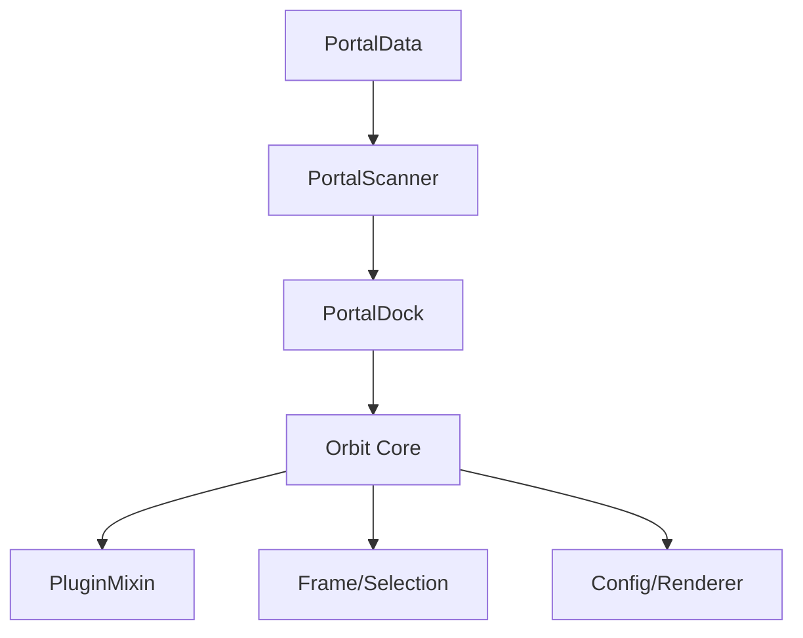

# orbit portal

dock-style portal UI with magnification effect. external plugin — depends on orbit core.

## purpose

replaces the need for portal addons with a macOS Dock-style interface showing available teleports, portals, hearthstones, toys, and housing. icons magnify on hover and support infinite scrolling with shift+scroll for category jumping.

## files

| file | responsibility |
|---|---|
| PortalData.lua | static portal/toy/hearthstone definitions. category order, seasonal dungeon/raid lists. |
| PortalScanner.lua | runtime detection of available portals. scans spells, toys, items, housing, and cooldowns. |
| PortalDock.lua | main plugin. dock frame, icon pool, magnification animation, scroll handling, settings UI. |

## architecture

## orbit core api surface

- `Orbit:RegisterPlugin()` — plugin registration and mixin application
- `Plugin:GetSetting()` / `SetSetting()` — per-layout setting persistence
- `OrbitEngine.Config:Render()` — settings panel rendering from schema
- `OrbitEngine.Frame:AttachSettingsListener()` — edit mode selection and drag
- `OrbitEngine.Frame:RestorePosition()` — saved position restoration
- `OrbitEngine.Pixel:Enforce()` — pixel-perfect scaling
- `Orbit.EventBus` — event subscriptions (edit mode, combat, visibility)
- `Plugin:RegisterStandardEvents()` / `RegisterVisibilityEvents()` — standard lifecycle

## rules

- this is an external plugin. it depends on orbit core but orbit core must never reference it.
- all secure button attributes must be cleared during edit mode (combat lockdown safety).
- cooldown display uses `SetCooldown()` — no manual OnUpdate tickers needed.
- portal scanning must be combat-safe. queue refreshes via `pendingRefresh` flag.
- all constants at file top. no magic numbers.
