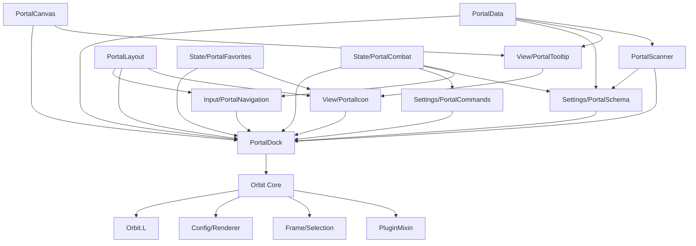

# orbit portal

dock-style portal UI with arc-wrap layout and edge-fade falloff. external plugin — depends on orbit core.

## purpose

replaces the need for portal addons with a compact dock showing available teleports, portals, hearthstones, toys, and housing. icons are laid out along a configurable arc and fade toward the edges; shift+scroll jumps between categories. while hovering the dock, typing a keyword (short code like `MT` or substring of the portal name) scrolls the match onto the icon slot nearest the cursor — printable keys are consumed by search so typing `M` doesn't also open the map, but ESC/Enter/F-keys/arrows/modifiers and any key while an editbox is focused still pass through. the search buffer clears after ~1s of idle or when the mouse leaves.

## layout

```
Core/
  PortalData.lua                    static definitions
  PortalScanner.lua                 runtime detection
  PortalLayout.lua                  pure arc / edge-fade math
  PortalCanvas.lua                  canvas mode icon components
  PortalDock.lua                    plugin root coordinator
  State/
    PortalFavorites.lua             favourite persistence model
    PortalCombat.lua                combat / encounter gating
  View/
    PortalIcon.lua                  secure icon factory + per-data configure
    PortalTooltip.lua               hover tooltip (M+ season best, cooldowns)
  Input/
    PortalNavigation.lua            scroll + keyword search handlers
  Settings/
    PortalSchema.lua                settings UI schema builder
    PortalCommands.lua              slash command handler
```

## files

| file | responsibility |
|---|---|
| PortalData.lua | static portal/toy/hearthstone definitions. category order, seasonal dungeon/raid lists, localized category names. |
| PortalScanner.lua | runtime detection of available portals. scans spells, toys, items, housing, and cooldowns. |
| PortalLayout.lua | pure layout math — arc-wrap positioning and edge-fade alpha. stateless functions only. |
| PortalCanvas.lua | Canvas Mode per-icon apply for DungeonScore, DungeonShort, Timer, FavouriteStar. shared `GetDungeonScoreColor` helper. |
| PortalDock.lua | plugin root. plugin registration, shared state + `ctx`, orientation detection, dock frame, canvas preview, `RefreshDock` orchestration, lifecycle + event fan-out. |
| State/PortalFavorites.lua | `IsFavorite` / `Toggle` / `GetKey` — favourite persistence through `Plugin:GetSetting/SetSetting`. |
| State/PortalCombat.lua | `CanInteract` gate + `UpdateState(ctx)` reconciler called on `PLAYER_REGEN_*` / `ENCOUNTER_*`. |
| View/PortalIcon.lua | `Create(ctx)` builds the reusable secure action button; `Configure(ctx, icon, data, index)` binds a portal row onto it. |
| View/PortalTooltip.lua | `Show(ctx, anchor, data)` — assembles the hover tooltip including M+ season-best with `issecretvalue()` guards. |
| Input/PortalNavigation.lua | `Install(ctx)` wires `OnMouseWheel` (normal + shift-category-jump) and creates a hidden capture-frame child of the dock for typeahead search. `ShowSearch`/`HideSearch` gate capture by hover. `RestorePropagationDefault` re-seats propagation after a combat-time `/reload`. `ClearSearchBuffer` called on `OnLeave`. |
| Settings/PortalSchema.lua | `Build(plugin, dialog, systemFrame, ctx)` — Layout + Categories tabs. |
| Settings/PortalCommands.lua | `Handle(ctx, cmd)` — `/orbit portal scan` and help. |

## architecture



## shared context

Extracted modules receive a single `ctx` table that `PortalDock.lua` owns and exposes as `addon.PortalDockContext`:

```
ctx = {
    plugin        = Plugin,        -- the registered Plugin object
    dock          = <Frame>,       -- populated once CreateDock runs
    state = {
        portalList, visibleIcons, scrollOffset,
        isMouseOver, isEditModeActive,
        pendingRefresh, mythicPlusCache,
    },
    RefreshDock   = <function>,    -- rebuild and repaint (gated by combat)
    RequestRefresh = <function>,   -- refresh now or defer to REGEN_ENABLED
}
```

Modules that need shared state read/write through `ctx.state`. Modules that need to trigger a rebuild call `ctx.RefreshDock()` / `ctx.RequestRefresh()`.

## orbit core api surface

- `Orbit:RegisterPlugin()` — plugin registration and mixin application
- `Plugin:GetSetting()` / `SetSetting()` — per-layout setting persistence
- `OrbitEngine.Config:Render()` — settings panel rendering from schema
- `OrbitEngine.Frame:AttachSettingsListener()` — edit mode selection and drag
- `OrbitEngine.Frame:RestorePosition()` — saved position restoration
- `OrbitEngine.Pixel:Enforce()` — pixel-perfect scaling
- `OrbitEngine.PositionUtils.ApplyTextPosition()` — Canvas Mode text layout
- `OrbitEngine.OverrideUtils.ApplyOverrides` / `ApplyFontOverrides` — per-component font/colour overrides
- `Orbit.EventBus` — event subscriptions (edit mode, combat, visibility)
- `Orbit.L` — localized strings (prefix `PLU_PORTAL_*`, `CMD_PORTAL_*`)
- `Plugin:RegisterStandardEvents()` / `RegisterVisibilityEvents()` — standard lifecycle

## rules

- this is an external plugin. it depends on orbit core but orbit core must never reference it.
- dependency direction is **inward only**: `PortalDock` → sibling modules → `PortalLayout` / `PortalCanvas` / `PortalData`. No sibling module requires `PortalDock` at file-scope load time; runtime lookups via `addon.Portal*` are fine.
- all secure button attributes must be cleared during edit mode (combat lockdown safety).
- cooldown display uses `SetCooldown()` — no manual OnUpdate tickers needed.
- portal scanning must be combat-safe. queue refreshes via `pendingRefresh` flag.
- all constants at file top. no magic numbers.
- user-visible strings go through `Orbit.L` (`PLU_PORTAL_*` for plugin UI, `CMD_PORTAL_*` for slash output). see `Orbit/Localization/README.md`.
- secret-value returns from `C_MythicPlus.GetSeasonBest*` are `issecretvalue()`-guarded before comparison/arithmetic or caching. never use `pcall` as a secret-value shield.
